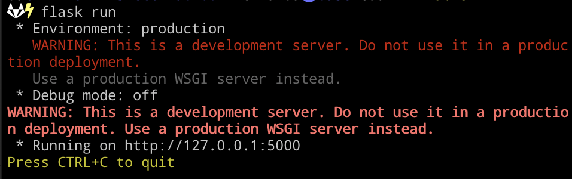

# CLIP-DallE-SketchFab-001

This flask app integrates several AI models to create and search for 3D models based on natural language prompts. It can be used inside Unity to generate scenes or objects from text descriptions. The app provides the following functionalities:

* `/get_scene_from_prompt`: Dall-E takes a prompt for a scene with multiple objects and generates an image of the scene with the indicated objects. Unity can use this image to determine the placements of SketchFab or primitive models in the scene.
* `/get_image_from_prompt`: Dall-E takes a prompt for a single object and generates an image of a 3D version of it. This image becomes the "Target" image that the app will try to match with a SketchFab model.
* `/get_closest_skfb_model`: The app queries the SketchFab API to download N different models from their free collection. Using CLIP, the app selects the N-subset models with the closest text descriptions to the prompt. From this subset, the app compares the models visually to the Target image and returns the SketchFab UID of the closest match. Unity can use this UID to download and display the correct SketchFab model.

The `demo_use_app.py` file demonstrates how to use all three functionalities.

## Installation

You will need to have Python 3.9 or higher in your system. You can use python or conda environments to install the requirements.

After you clone the repo, create a python environment inside the local folder:

```
python -m venv .venv
source .venv/bin/activate
```

Then, install the list of requirements:

```
pip install -r requirements.txt
```

You can now run the flask app:

```
flask run 
```

In your terminal, you should see something like the image below. The app is now running on your local server and you can go back to Unity and enable the use of this app.



If you encounter any import or dependency issues, you can run `python app.py` to see the error messages. Install any missing dependencies as needed.
