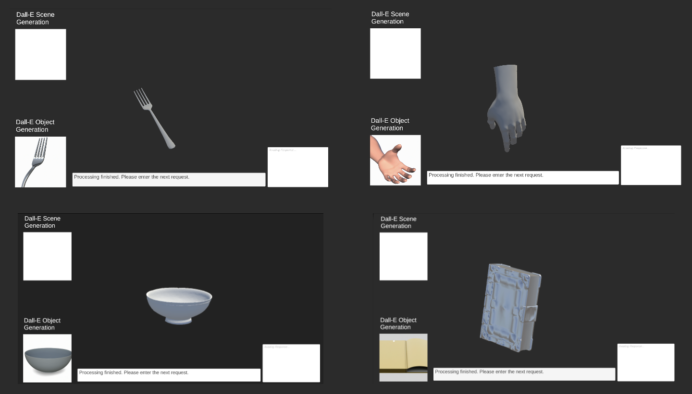
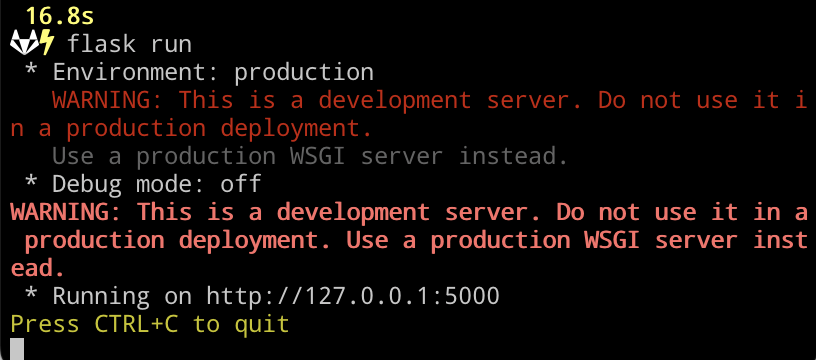

# Mixed-Reality Copilot


## Introduction

This package serves as a prototype for "Speaking the world into existence", which allows the real time creation of objects, tools, and scenes with visual, behavioral, and interactive elements through natural language. Our framework combines prompt-based generation with Unity to enable spontaneous user creation at run time, a core element of VR since its inception. The package comes with three demo scenes for you to experiment with: an empty playground in which you can create objects in isolation; a bathroom scene with some existing objects to interact with and modify, and a scene that engages Dall-E and CLIP to find 3D models that are visually and textually similar to your prompt. 

Example use cases:

- Object creation: you can create objects out of Unity primitives or models from Sketchfab, an online repository of 3D models. For example, you can ask GPT to create a car out of Unity primitives.
- Behavior programming: you can endow objects with properties to make tools out of them. For example, you can create a timer out of a rotating cube that stops its movement when the countdown reaches 0.
- Scene editing: you can modify existing scenes in creative or useful ways at runtime, such as changing colors on various objects to suit a color-blind person.

## Demo Scenes

### Empty Playground

- Open the scene `Playground_new`
- In the “Game” window, navigate to the input field at the bottom and type in your instructions in natural language. When finished, press *Tab* to send the request for GPT to process.
  - As an example, try: creating a rotating cube that changes color every second.
  - After GPT is done, look at Console to see if its code generated any compilation/runtime errors.
- The message `Processing finished. Please enter the next request.` will be displayed in the input field when it is done. You can inspect the results and make further requests if desired.
- The actual code executed as well as the conversation history can be found in the public fields **Output** and **History** found on the **Builder** gameObject.

Remarks:

- GPT’s ability to carry out your request may depend on how the prompt is phrased, so try a few different ways if GPT got it wrong the first time.
- A code Inspector can be used to automatically check for common errors in GPT’s generated code. Use it if GPT seems to have trouble fulfilling a particular request.
  - To use the Inspector, send over the typed-out requests with *Right Control* instead of *Tab*.


### Dall-E & CLIP Refinement for 3D Object Creation

* Open the scene named `Playground_DallE-CLIP_Refinement`. It contains the necessary components to use Dall-E and CLIP to find the closest Sketchfab model to your request.
* Unlike the previous scene, you can ask for objects that are not randomly drawn, but rather resemble what Dall-E might generate.
* For example, in the picture below, different objects were requested: "a fork", "a bowl", "a hand", "a book".
* However, before you can use this functionality, you need to clone a separate repo to your machine and run a Python Flask app. Ask us for GitHub access and follow the next step: "Set Up for CLIP-DallE-SketchFab-001 Flask App".

  The Flask app can also help you generate entire scenes, such as "farm with 2 cows and a horse" and engage a GPT-depth inferencer. A future release should contain a scene that employs this ability.
  


## Set Up for CLIP-DallE-SketchFab-001 Flask App

First clone the repo for the flask app or unzip the folder **"CLIP-DallE-SketchFab-001-main.zip."**

`git clone https://github.com/delamarifer/CLIP-DallE-SketchFab-001.git`

This flask app integrates several AI models to create and search for 3D models based on natural language prompts. It can be used inside Unity to generate scenes or objects from text descriptions. The app provides the following functionalities:

* `/get_scene_from_prompt`: Dall-E takes a prompt for a scene with multiple objects and generates an image of the scene with the indicated objects. Unity can use this image to determine the placements of SketchFab or primitive models in the scene.
* `/get_image_from_prompt`: Dall-E takes a prompt for a single object and generates an image of a 3D version of it. This image becomes the "Target" image that the app will try to match with a SketchFab model.
* `/get_closest_skfb_model`: The app queries the SketchFab API to download N different models from their free collection. Using CLIP, the app selects the N-subset models with the closest text descriptions to the prompt. From this subset, the app compares the models visually to the Target image and returns the SketchFab UID of the closest match. Unity can use this UID to download and display the correct SketchFab model.

The `demo_use_app.py` file demonstrates how to use all three functionalities.

## Installation

You will need to have Python 3.9 or higher in your system. You can use python or conda environments to install the requirements.

After you clone the repo, create a python environment inside the local folder:

```
cd CLIP-DallE-SketchFab-001
python -m venv .venv
source .venv/bin/activate
```

Then, install the list of requirements:

```
pip install -r requirements.txt
```

You can now run the flask app:

```
flask run 
```

In your terminal, you should see something like the image below. The app is now running on your local server and you can go back to Unity and enable the use of this app.



If you encounter any import or dependency issues, you can run `python app.py` to see the error messages. Install any missing dependencies as needed.


## Remarks

- The project is under heavy construction right now. functionalities are constantly being added, which sometimes create unexpected interactions with previous components. Please be expectant of errors when you play with the framework.
- More documentation on various components incoming... In the meantime, please reach out if you have questions!
- There is a slim chance that some required .dll files are not included in the **Assemblies** folder for your use case, which will give runtime errors like `The required namespace xxx cannot be found. Are you missing an assembly reference?`. Please reach out if this happens!

## Contributing

This project welcomes contributions and suggestions.  Most contributions require you to agree to a
Contributor License Agreement (CLA) declaring that you have the right to, and actually do, grant us
the rights to use your contribution. For details, visit https://cla.opensource.microsoft.com.

When you submit a pull request, a CLA bot will automatically determine whether you need to provide
a CLA and decorate the PR appropriately (e.g., status check, comment). Simply follow the instructions
provided by the bot. You will only need to do this once across all repos using our CLA.

This project has adopted the [Microsoft Open Source Code of Conduct](https://opensource.microsoft.com/codeofconduct/).
For more information see the [Code of Conduct FAQ](https://opensource.microsoft.com/codeofconduct/faq/) or
contact [opencode@microsoft.com](mailto:opencode@microsoft.com) with any additional questions or comments.

## Trademarks

This project may contain trademarks or logos for projects, products, or services. Authorized use of Microsoft 
trademarks or logos is subject to and must follow 
[Microsoft's Trademark & Brand Guidelines](https://www.microsoft.com/en-us/legal/intellectualproperty/trademarks/usage/general).
Use of Microsoft trademarks or logos in modified versions of this project must not cause confusion or imply Microsoft sponsorship.
Any use of third-party trademarks or logos are subject to those third-party's policies.

## Data Privacy Notice

Please see: [Data Privacy Notice](https://privacy.microsoft.com/en-US/data-privacy-notice)
